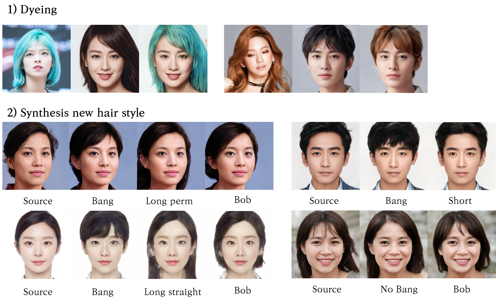
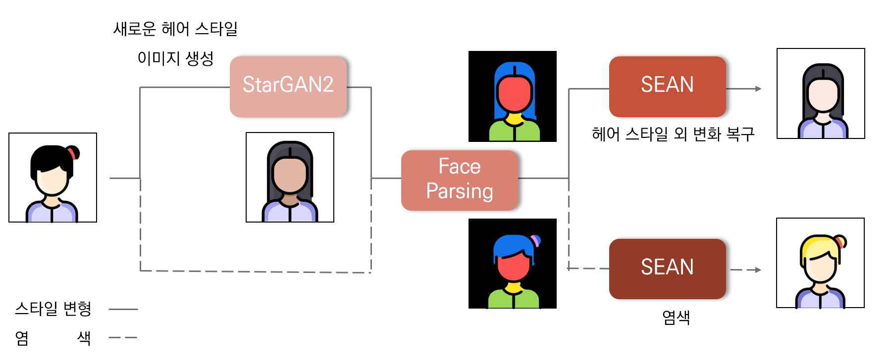

# Hair-synthesis-using-GAN

#### ❗ Pre-trained models can no longer be provided due to problems such as performance and contracts. Sorry for not being able to help.

## Before start
This project was conducted for the 12th 'BOAZ'(Korea Big Data Student Club) Conference. Details can be found in the [presentation materials](https://www.slideshare.net/BOAZbigdata/12-boaz-gan), [presentation videos](https://www.youtube.com/watch?v=v9WjCrZEFeU&t=8s), and [project memoirs](https://comlini8-8.tistory.com/49). (All of these materials are written in Korean.)

## Introduction
This is a project that uses GAN-based models (StarGAN-v2) to learn various hairstyles of people and create images with learned hairstyles. To address changes in other features such as skin and makeup other than hair style throughout the GAN model, we have used the Segmentation map-based GAN model (SEAN) additionally.

## Process

This model allows 1)dyeing and 2) hair style changes.

### 1)Dyeing
Dyeing only goes through SEAN models. Use the image of the desired hair color, the segmentation map of the image, the Src image (= image of the person who wants to change the hairstyle), and the segmentation map of the image as input to the SEAN model. The segmentation map of the image is obtained through the BiSeNet-based Face parsing model.(The parsing process is also included in the code, so you only need to insert the image.)

### 2)Hair Style Changes
First, the Src image goes through the learned StarGAN-v2 model. You can convert the Src image to a total of 7 domains.(Bang, No Bang, Long straight, Long perm, Bob, Short, Blond) Image conversion methods include 1) importing styles of reference images, and 2) mapping random vectors into style vectors of a particular domain to create images. These newly generated images, segmentation maps of generated images, Src images, and segmentation maps of src images are used as input to the SEAN model.

## References
- [StarGAN-v2](https://github.com/clovaai/stargan-v2)
- [SEAN](https://github.com/ZPdesu/SEAN)
- [CBAM_PyTorch](https://github.com/luuuyi/CBAM.PyTorch)
- [face-parsing.PyTorch](https://github.com/zllrunning/face-parsing.PyTorch)
